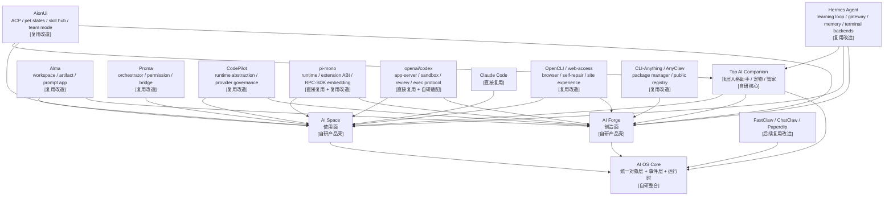

# AI OS 总产品蓝图

## 1. 文档目的

这份文档定义我们的终极产品方向，以及当前阶段到终局的统一路线。

它回答 8 个核心问题：

- 我们到底在做什么
- 为什么它不是普通 AI 客户端
- 为什么它不仅是一个工具，更是一个平台
- 为什么前期拆成两个产品是合理的
- 多 AI、多 Agent、自动化、能力市场如何统一
- 为什么我们不仅要给用户一个空间，还要给 Agent 一个环境
- 外部世界的数据和能力如何接进来
- 未来如何自然演进成“本地 + 云端”双模式的完整 AI OS

一句话概括：

**我们要做的是一个本地优先、可多端延展、可持续运行、可沉淀能力、可形成 Store 生态、最终演进为本地 + 云端双模式的 AI Native Data OS。**

---

## 2. 产品定义

### 2.1 它不是什么

它不是：

- 一个更花哨的聊天工具
- 一个只支持更多模型的壳
- 一个把终端、自动化、插件硬堆进去的大杂烩
- 一个只服务程序员的 AI IDE
- 一个纯自动化后台
- 一个 prompt 市场
- 一个只有“技能列表”的工具箱

### 2.2 它是什么

它是：

- 一个全能的个人 AI 助手
- 一个属于用户自己的 AI 空间
- 一个承接生活与工作的系统
- 一个支持日常 chatbot 对话、代码执行、自动化和主动提醒的本地智能体
- 一个可接入用户自定义大模型厂商、中转站、API URL 和 API Key 的模型运行面
- 一个支持多智能体协作的运行环境
- 一个兼容 API、CLI、浏览器、本地应用和多端入口的智能操作层
- 一个可以把成功流程沉淀为可复用能力并分发出去的平台
- 一个能够把能力包装成可安装 App / 小场景，并通过 Store 分发的平台

最终形态可以用一句话定义：

**不是只和 AI 聊天，而是拥有一个持续存在的个人 AI 助手，在同一个空间里完成日常对话、代码任务、自动化、主动提醒和能力沉淀，并最终演进为平台生态。**

---

## 3. 核心世界观

### 3.1 一切底层都是数据

文本、文件、网页、消息、代码、图片、音频、视频、任务、状态、执行记录，本质上都只是不同形态的数据。

### 3.2 AI 是新的理解层和执行层

AI 的价值不是多说话，而是：

- 理解数据
- 发现关系
- 生成结构
- 调用能力
- 持续执行
- 协同分工
- 沉淀经验

### 3.3 人类需要的是“空间”，而不是更多功能入口

传统软件的问题不是缺功能，而是：

- 数据分散
- 工具割裂
- 上下文埋没
- 自动化不连续
- 成果难复用

所以我们真正要做的，不是某一个功能，而是一个新的默认数字空间。

### 3.4 产品的核心职责

我们的系统做六件事：

1. 接入和组织数字世界中的数据
2. 把这些数据变成 AI 易理解、易执行、可持续利用的形态
3. 让多个 AI / Agent 可以在同一空间中协作推进事情
4. 把成功流程沉淀成可复用能力，进入个人、团队与市场体系
5. 让成熟能力能以 App / 小场景的形式直接在产品中运行和展示
6. 用统一对象层和统一事件层，把生活软件、工作软件和本地环境汇聚成一个平台

---

## 4. 产品哲学

### 4.1 AI Native

用户给的是目标，不是命令。  
系统默认要负责：

- 理解意图
- 生成结构
- 推荐下一步
- 持续推进任务
- 沉淀可复用能力

### 4.1.1 Companion Native

用户进入系统后，不应该先面对一堆模块、Agent、执行器和配置项，  
而应该先面对一个持续存在的顶层 AI 助手。

这个助手应同时具备：

- 人格化外显层
- 统一对外入口
- Mission 总控能力
- 长期记忆与状态感知
- 主动提醒与 heartbeat 能力
- 对下层 Worker / Executor / Connector 的调度权

这意味着系统最终应形成一种非常清楚的关系：

- 用户先认识“它”
- “它”再调用系统的一切能力
- 底下可以有很多 Worker 和执行器，但对用户呈现出来最好仍是同一个连续主体

### 4.2 Data Native

不要按 App 或页面切分世界，而要按数据、关系、能力、结果切分世界。

### 4.3 Object Native

只说“统一数据”还不够。  
系统最终必须尽量统一成一组核心对象，让 Agent、App、Connector 工作在同一层语义上。  
建议长期收敛为：

- Message
- Document
- File
- Task
- Event
- Person
- Artifact
- Action

未来不管接的是 Mail、Google、微信、GitHub 还是本地目录，最终都应尽量映射成这组对象。

### 4.4 Space Native

重要信息不应该藏在时间线里。  
计划、执行、结果、自动化、协作都应该在空间里共存并可见。

### 4.5 Multi-Agent by Design

未来强系统不是“一个大模型做完所有事”，而是：

- 多个角色化智能体分工
- 不同能力之间协作
- AI 调 AI
- AI 验证 AI
- AI 帮助系统持续进化

### 4.6 Continuous by Default

系统默认是持续运行的，不是一次性的会话工具。  
用户离开后，任务仍然可以继续推进。

### 4.7 Composable

一切有价值的工作流程，都应该逐渐沉淀成可复用能力。

### 4.8 Platform Native

我们最终做的不只是一个很强的工具，而是一个平台。  
这意味着系统要同时支持：

- 用户在空间中直接使用
- 作者把流程做成 App
- 团队共享能力
- 平台做验证、审核、推荐和升级

也就是说：

- `AI Space` 是使用面
- `AI Forge` 是创造面
- `Store` 是分发面
- `Capability Layer` 是平台底座

### 4.9 Trust First

自动化越强，越需要：

- 权限边界
- 审批节点
- 来源透明
- 历史记录
- 能力验证
- 风险等级

进入平台和 Store 阶段后，还必须额外提供：

- 发布前验证
- 行为回放
- 权限与数据访问说明
- App 信任等级
- 最近验证时间与兼容信息

### 4.9.1 AI-friendly

这里的 `AI-friendly` 不是“只会给 AI 用”，而是：

- 系统对象对 AI 易理解
- 状态、事件、权限、结果尽量结构化
- 能力契约可机器读取
- 执行过程可回放、可诊断、可修复
- 执行器可替换、可编排、可比较

也就是说，系统不能只对人类界面友好，还必须对 AI 作为长期操作者友好。

### 4.9.2 Iterative-friendly / 渐进友好

这里的 `Iterative-friendly / 渐进友好` 指的是：

- 允许人和 AI 以渐进式、边做边修、边试边推进的方式逼近目标
- 不强迫用户一开始就把所有输入和流程一次性想清楚
- 支持中途插话、局部重跑、局部验证、回滚、审批后继续
- 支持从一次性操作逐渐沉淀为稳定能力

换句话说，系统必须鼓励“逐步逼近正确答案”，而不是逼用户或 AI 一口气压完整条链路。

### 4.9.3 Human-friendly

这里的 `Human-friendly` 指的是：

- 默认只需要理解一个顶层 AI 助手，而不是一堆内部系统角色
- 重要状态必须可见
- 高风险动作必须可控
- 结果必须易读、易看、易回到空间里继续使用
- 高级能力存在，但不能逼普通用户先学配置和底层概念

真正对人类友好，不是把系统做简单，而是把复杂性藏到合适的位置。

### 4.9.4 Community Native

如果我们要面向未来社区，系统从第一天起就要支持：

- 社区作者能贡献能力
- 能力能版本化、验证、分级、回滚
- 社区修复适配器和能力时，有标准入口
- 平台能对社区能力给出清楚的信任标识和兼容信息

也就是说，我们不是以后“再想社区”，而是现在就要为社区预留清晰对象和治理结构。

### 4.10 Environment over Tools

对 Agent 来说，最重要的不是“拿到很多工具”，而是“拥有一个可编程环境”。

这意味着系统底层不能只是零散工具集合，而必须提供：

- 可组合的原语
- 可沉淀的能力
- 可修复的适配器
- 可验证的执行结果
- 可不断生长的能力环境

### 4.11 Control Plane over Executors

我们不需要从第一天起重造所有最强执行器。  
更合理的路线是：

- 复用当前最强的专用执行器
- 自己掌握空间、编排、治理和能力模型

尤其在 `Code` 这一层，应明确坚持：

- 代码执行能力优先直接接入 `Claude Code`、`Codex`
- 可以参考 Claude Agent SDK 一类接入方式
- 但系统内核只认我们自己的 `Code Executor` 协议
- 不让任何单一 SDK 或厂商协议定义我们的系统结构

例如：

- 写代码可优先接入 `Claude Code`、`Codex`
- 网站能力可内化 `OpenCLI` 这类能力系统的思路
- Bot / runtime / 长任务 / 多渠道等问题，用我们自己的方式重做

---

## 5. 当前阶段与终局路线

### 5.1 当前阶段的正确策略

当前阶段我们不做纯云产品，而是：

**本地优先 + 多端延展**

这意味着：

- 主产品运行在本地
- 桌面端是核心体验
- Web / 手机 / 其他端做轻量继续和查看
- 本地文件、终端、CLI、浏览器 relay、本地自动化都能发挥最大价值

### 5.2 为什么现在不直接做纯云

因为现在最需要验证的是：

- 无限画布作为 AI 主界面是否成立
- 本地 AI 空间是否足够有差异化
- 多智能体协作是否成立
- 日常与代码双场景是否成立
- 真实流程能否沉淀为能力
- App / 小场景形态是否成立

这些都更适合先在本地优先产品中验证。

### 5.3 终局路线

终局不是否定本地，而是演进为：

**本地 + 云端双模式 AI OS**

也就是说：

- 用户可以纯本地使用
- 也可以本地增强 + 云端协同
- 未来还能演进为云托管能力和团队协作模式

### 5.4 当前阶段明确不做

为了避免第一阶段被终局愿景拉得过大，当前阶段需要明确收住范围。

当前阶段不做：

- 公开能力市场
- 复杂商业化结算
- 复杂团队权限体系
- 大规模 swarm 编排
- 完整云端托管运行时
- 全量生活软件连接器
- 完整社区审核与治理流程
- 把所有参考项目直接 vendor 进主仓库
- 让 UI 层直接依赖某个执行器 SDK
- 把高级配置暴露给普通用户作为第一入口

这些方向可以预留对象和协议边界，但不应成为第一阶段的交付阻塞项。

### 5.5 V0.1 产品目标

`V0.1` 的目标不是完整 `AI OS`，也不是只做 coding 工具，  
而是先跑通一个全能个人 AI 助手的最小骨架。

V0.1 必须证明：

- 用户可以进行普通 chatbot 对话
- 用户可以配置自定义模型厂商或中转站
- 用户可以用自定义 API URL 和 API Key 接入模型
- 系统可以同时接入 `Codex` 和 `Claude Code` 作为一等 Code Executor
- Companion 通过统一 Control Plane 推进 Mission
- Code Executor 的执行过程能沉淀为 Run、Event、Approval 和 Artifact
- Artifact 能回到当前 Space，继续被查看、追问和使用

V0.1 暂不证明：

- 完整 Forge 产品壳
- 公开 Store
- 复杂自动化平台
- 完整邮件、日历、IM 等 Connector
- 云端协作与团队模式
- 大规模多 Agent swarm

---

## 6. 产品体系结构

终极产品由两个前期独立产品自然统一而来：

### 6.1 顶层 AI Companion

在 `AI Space`、`AI Forge` 和最终 `AI OS` 之上，  
应该存在一个统一的顶层 AI 助手。

它不是一个普通聊天头像，而是：

- 用户的主入口
- 系统的对外人格
- 所有 Mission 的默认总控者
- 默认的解释者、提醒者、协调者

用户进入系统后，首先与它互动。  
之后由它来调用：

- `AI Space`
- `AI Forge`
- Worker Agent
- 各类 Executor
- 各类 Connector

### 6.2 AI Space

面向所有用户的主产品。  
解决“我要做事、我要继续我的空间、我要让 AI 帮我推进”的问题。

它同时也是平台的默认运行面，也就是：

- 用户安装 App 后，App 在这里运行
- 小场景在这里展示
- 结果和 Artifact 在这里沉淀

### 6.3 AI Forge

面向高级用户、开发者、团队与生态作者。  
解决“我要把已经跑通的事情抽象成能力，并验证、共享、发布出去”的问题。

它同时也是平台的：

- App / Connector / Skill 创作面
- Store 的供给侧入口
- 验证、审核与发布中心

### 6.4 AI OS Core

用户前期不一定直接感知到的统一底层核心。  
它负责：

- 身份
- 空间
- 任务
- 多智能体运行
- 自动化
- 能力
- 结果
- 信任体系
- Store 与分发基础

### 6.4.1 Model Provider Layer

`Model Provider Layer` 是系统的一等基础层，不能被混进 Executor Layer。

它负责：

- 管理模型厂商
- 管理自定义 API URL
- 管理 API Key / Token
- 管理模型列表
- 测试连接可用性
- 区分 OpenAI-compatible、Anthropic-compatible 等协议
- 为普通聊天、Companion、总结、记忆、自动化和 Forge 验证提供模型能力

第一阶段至少要支持：

- OpenAI-compatible 自定义 `baseUrl + apiKey`
- Anthropic-compatible 自定义 `baseUrl + apiKey`

这里的 Provider 解决“用哪个模型思考和生成”，  
Executor 解决“用哪个执行环境完成任务”。  
二者必须分层，不能互相替代。

### 6.5 最终统一为 AI OS

统一后不是“两个产品拼接”，而是：

- 顶层有一个持续存在的 AI Companion
- `Use` 模式：使用空间与能力
- `Create` 模式：构建、验证、发布能力

两种模式共享同一套：

- Self
- Space
- Object
- Mission
- Flow
- Agent
- Capability
- Artifact
- Trust

### 6.6 现实复用策略

前期我们不应该“从零重造一切”，而应该明确区分：

- 哪些直接复用
- 哪些复用后改造
- 哪些必须自己写

推荐统一使用下面 3 个标签：

- `[直接复用]`
- `[复用改造]`
- `[自研]`

当前最值得吸收的项目来源如下：

| 层 | 主要来源 | 我们怎么用 |
|---|---|---|
| 产品对象模型 | `Alma` | 吸收 `workspace / artifact / prompt app` 作为一等对象 `[复用改造]` |
| 控制层 / 编排层 | `Proma`、`CodePilot` | 吸收 `orchestrator / bridge / permission / ask-user / runtime governance` 思路 `[复用改造]` |
| Agent runtime / session / extension | `pi-mono`、`Hermes Agent` | `pi-mono` 作为 runtime-core、extension ABI、prompt/resource loader、RPC/SDK embedding、provider policy 参考；`Hermes Agent` 作为 learning loop、gateway、memory provider、terminal backend 参考 `[直接复用 + 复用改造]` |
| 代码执行器 | `Claude Code`、`openai/codex` | 作为下层强代码执行器；`Codex app-server` 可作为正式 JSON-RPC executor 后端参考，通过自有 `Code Executor` 协议接入 `[直接复用 + 自研适配]` |
| 浏览器 / 网站 / 外部软件能力 | `OpenCLI`、`web-access` | 作为连接器与能力沉淀来源，重点吸收自修复、结构化诊断、站点经验和 CDP proxy `[复用改造]` |
| 能力仓库 / 安装 / 搜索 / repo | `CLI-Anything`、`AnyClaw` | 作为 `AI Forge` 的 capability package manager、installer lifecycle、public registry 参考 `[复用改造]` |
| 桌面壳 / provider / 本地配置经验 | `AionUi` | 吸收桌面打包、ACP 模块化协议、桌宠状态机、内置技能管理、team/remote agent、cron/channel/plugin 经验 `[复用改造]` |
| 长任务 / 多 Agent / 云端演进 | `FastClaw`、`ChatClaw`、`Paperclip`、`Hermes Agent` | 作为后续完整 AI OS 的 runtime / orchestration / community / gateway / scheduled automation 参考 `[复用改造]` |

### 6.6.1 第一阶段吸收优先级

参考项目很多，第一阶段不能平均吸收。  
建议先按下面优先级推进：

| 优先级 | 项目 | 第一阶段用途 |
|---|---|---|
| P0 | `CodePilot` | 作为自定义模型 Provider、连接测试、错误诊断和 provider governance 参考 |
| P0 | `openai/codex` app-server | 作为 `Code Executor Protocol` 的首要协议参考 |
| P0 | `Claude Code` | 作为 V0.1 必须支持的一等 Code Executor 和真实 coding 体验基准 |
| P0 | `pi-mono` | 作为 runtime、session、resource loader、extension ABI 的首要参考 |
| P0 | `Alma` | 作为 `Workspace / Artifact / Prompt App` 产品对象参考 |
| P1 | `Proma` | 吸收 orchestrator、permission、ask-user 和 bridge 思路 |
| P1 | `OpenCLI`、`web-access` | 吸收 browser connector、站点经验、自修复与诊断思路 |
| P2 | `AnyClaw`、`CLI-Anything` | 吸收 registry、installer、skill generation 和验证方法 |
| P2 | `AionUi`、`Hermes Agent`、`FastClaw` | 吸收 gateway、cron、memory、team 和多入口运行经验 |
| P2 | `Agor`、`TermCanvas`、`OpenCove` | 吸收空间画布、worktree、terminal 和多 Agent 可视化经验 |

P0 的目标是帮助第一版跑通主闭环。  
P1 和 P2 更适合在主闭环稳定后逐步吸收。

### 6.7 从前期产品到最终 AI OS 的复用映射



一句话说清楚：

- 顶层必须有一个人格化 AI Companion，用户先面对它，再通过它使用系统
- `AI Space` 前期重点吸收 `Alma + Proma + CodePilot + pi-mono + Claude Code/openai Codex + Hermes Agent + OpenCLI/web-access`
- `AI Forge` 前期重点吸收 `pi-mono + OpenCLI + CLI-Anything/AnyClaw + Codex app-server + Hermes learning loop + CodePilot runtime governance + Alma capability 思路`
- 最终 `AI OS` 再把长期运行、多 Agent、平台化和服务化能力统一收束

### 6.8 六根主梁

为了保证我们是按“长期最优产品”而不是“短期方便实现”来设计，  
系统必须先钉死 6 根内核主梁：

1. `Companion`
2. `Kernel Objects`
3. `Capability Contract`
4. `Executor Protocol`
5. `Event Bus`
6. `Trust / Approval / Replay`

这 6 根主梁的原则是：

- 上层产品形态可以继续生长
- 下层执行器和连接器可以不断替换
- 社区能力可以不断接入
- 但这 6 根主梁不能轻易漂移

后续文档中的正式落点为：

- `Companion`：`AI Space` 文档
- `Kernel Objects`：本文件
- `Capability Contract`：能力层文档 + `AI Forge` 文档
- `Executor Protocol`：能力层文档 + `AI Forge` 文档
- `Event Bus`：能力层文档
- `Trust / Approval / Replay`：能力层文档 + `AI Forge` 文档

### 6.9 推荐仓库结构与模块边界

为了让系统既能长期长大、又能对未来社区友好，  
推荐从第一天起就采用清晰的 monorepo 分层，而不是把所有东西堆在一个应用目录里。

建议长期结构如下：

```text
repo/
  apps/
    space-desktop/
    forge-desktop/
    companion-daemon/
    store-web/                  # 后续

  packages/
    companion/
      companion-core/
      companion-memory-view/
      companion-presence/

    kernel/
      kernel-objects/
      kernel-events/
      kernel-runs/
      kernel-memory/
      kernel-trust/

    control/
      control-plane/
      task-routing/
      approval-engine/
      automation-engine/

    conversation/
      conversation-core/

    model-providers/
      provider-protocol/
      provider-openai-compatible/
      provider-anthropic-compatible/

    runtime/
      runtime-core/
      runtime-session/
      runtime-extension/

    capability/
      capability-contract/
      capability-builder/
      app-surface-runtime/
      validation-core/
      registry-core/
      publish-core/

    workspace/
      workspace-core/
      artifact-core/
      thread-core/

    ui/
      ui-design-system/
      ui-canvas/
      ui-panels/
      ui-node-renderers/

    executors/
      executor-protocol/
      executor-claude-code/
      executor-codex/
      executor-opencli/
      executor-browser/
      executor-local-cli/

    connectors/
      connector-protocol/
      connector-browser-session/
      connector-git/
      connector-mail/
      connector-calendar/
      connector-drive/
      connector-im/

    sdk/
      sdk-app/
      sdk-connector/
      sdk-community/

  vendor/
    pi-mono/
    opencli/
    web-access/

  community/
    official-apps/
    official-connectors/
    official-recipes/
    templates/

  examples/
  tests/
```

这里最重要的边界不是“目录好不好看”，而是下面这些原则：

- `apps/` 只放用户可见产品壳，尽量保持薄
- `packages/kernel/` 只放最稳定的内核对象和协议，不掺产品页面逻辑
- `packages/model-providers/` 只放模型厂商、协议、凭证和模型调用适配，不放任务执行逻辑
- `packages/executors/` 只放执行器适配，不放产品规则
- `packages/connectors/` 只放外部连接和对象映射，不放 Companion 或 UI 逻辑
- `vendor/` 明确保存上游 fork 来源，便于协议合规和社区理解
- `community/` 明确区分官方能力与社区能力，便于未来治理

这个结构不是为了限制功能，而是为了保证：

- 愿景可以很大
- 社区可以很大
- AI 可以大规模生成代码
- 但仓库不会越长越乱

### 6.10 本地优先的数据落点原则

第一阶段不需要先设计完整数据库 schema，但必须先明确数据归属，避免后续所有状态混在应用壳里。

建议遵循：

- 产品状态进入本地数据库
- `Workspace` 文件优先留在用户目录或项目目录
- `Artifact` 可以存入本地托管目录，也可以引用 workspace 内文件
- `Run`、执行事件、审批记录和 replay 信息进入 runs / events 存储
- 凭证进入系统 keychain 或受保护的 secret store，不进入普通配置文件
- Connector 拉取的外部数据先映射成统一对象，再进入 Space 或 App
- 社区能力和官方内核分层保存，不混入核心业务包
- 用户内容默认不上传云端，除非用户明确启用同步或远程运行

V0.1 的数据落点可以先按下面的最小映射理解：

| 对象 | V0.1 落点 |
|---|---|
| `Space` / `Canvas layout` | 本地数据库 |
| `Workspace` | 用户目录或项目目录的引用 |
| `Thread` / `Message` | 本地数据库 |
| `Mission` / `Run` / `Event` / `Approval` | 本地数据库 |
| `Artifact` | 本地托管目录或 workspace 文件引用 |
| `ProviderConfig` | 本地数据库 |
| `API Key / Token` | 系统 keychain 或受保护 secret store |

---

## 7. 核心对象模型

### 7.0 Kernel Objects 与 Derived Objects

为了兼顾“终局最优”与“长期可演进”，对象层必须区分两类：

#### 7.0.1 Kernel Objects

这些是平台最稳定的底层对象，应该尽早定住：

- `Workspace`
- `Thread`
- `Task`
- `Artifact`
- `Run`
- `App`
- `Connector`
- `Event`
- `Memory`

它们是：

- Companion 理解世界的底座
- Space 和 Forge 共用的底座
- 社区能力与执行器共同工作的底座

#### 7.0.2 Derived Objects

这些对象同样重要，但更适合建立在 Kernel Objects 之上：

- `Goal`
- `Mission`
- `Prompt App`
- `Recipe`
- `Skill Pack`
- `Agent Pack`
- `Organization Template`
- `Trust Report`

这些对象可以继续长、继续细化、继续演进，  
但不应反过来破坏 Kernel Objects 的稳定性。

#### 7.0.3 核心术语边界

为了避免后续实现时概念混用，第一阶段建议先按下面的边界使用术语：

| 术语 | 边界 |
|---|---|
| `Space` | 用户感知的空间容器，承载任务、对象、画布和能力运行面 |
| `Workspace` | Space 背后的真实工作区，通常绑定本地目录、项目或 worktree |
| `Canvas` | Space 的可视化页面，不等同于数据模型本身 |
| `Thread` | 对话、执行历史和上下文组织容器 |
| `Goal` | 用户输入的初始意图 |
| `Mission` | 系统正式承接并持续推进的一件事 |
| `Task` | Mission 下可拆解、可分配、可追踪的工作单元 |
| `Run` | 某个 Agent、Executor 或 Capability 的一次实际执行 |
| `Artifact` | 执行产生的结果或中间产物，可预览、引用、继续编辑 |
| `Capability` | 可复用能力抽象，包括 App、Recipe、Skill、Connector 等 |
| `App` | 有输入、输出、权限、运行逻辑和 Surface 的成品能力 |
| `Connector` | 外部系统到统一对象层的映射入口 |

### 7.1 Self

用户本人及其长期上下文：

- 偏好
- 记忆
- 账号连接
- 常用能力
- 通知方式
- 设备关系

### 7.2 Space

承载一切的空间。  
它可以是：

- 日常空间
- 工作空间
- 学习空间
- 内容空间
- 项目空间
- 团队空间

每个 `Space` 在产品上都应该尽量绑定一个真实工作区。  
所以 `Space` 不是纯视觉容器，而是任务、文件、Artifact、终端、预览、自动化和记忆的共同上下文。

### 7.3 Object

`Object` 是整个系统真正共享的语义底座。  
长期建议统一为：

- Message
- Document
- File
- Task
- Event
- Person
- Artifact
- Action

它让：

- Connector
- App
- Agent
- Space

不必围着某个平台私有字段工作，而能围绕统一对象层协作。

### 7.4 Mission

用户当前要完成的一件事。  
它可以是一次性的，也可以是长期的。

### 7.5 Flow

Mission 的推进路径：

- 单次执行
- 多步流程
- 定时流程
- 触发流程
- 审批流程

### 7.6 Agent

系统中的智能体单元。  
至少要支持：

- Persona Agent
- Worker Agent
- System Agent
- Capability Agent

### 7.7 Capability

系统或生态中的能力单元：

- App
- Skill
- Recipe
- Connector
- Automation Template
- Agent Pack
- Organization Template

### 7.8 App

`App` 是能力层里最重要的成品对象。  
它不是普通网页，也不是孤立插件，而是：

- 一个有明确输入、输出、权限、依赖连接器、运行逻辑和展示界面的场景包

一个 App 可以表现为：

- Panel App
- Background App
- Trigger App
- Flow App

### 7.9 Connector

`Connector` 是平台连接外部世界的标准接口对象。  
它负责：

- 认证
- 拉取数据
- 推送动作
- 映射到统一对象层

接入优先级应固定为：

1. 官方 API / SDK
2. CLI
3. Browser / Extension / Automation
4. 自研适配器
5. 等未来开放接口

### 7.10 App Contract

每个 App 都必须有标准契约。  
至少应声明：

- 处理哪些对象
- 依赖哪些 Connector
- 需要哪些权限
- 输入是什么
- 输出是什么
- UI Surface 是什么
- 是否支持后台运行
- 是否支持自动化触发
- 是否支持多 Agent 协作

### 7.11 Artifact

执行过程中产生的一切结果：

- 文档
- 代码
- 图像
- 视频
- 发布内容
- PR
- 表格
- 分析报告

某些成熟 Artifact 未来还应直接上升为：

- 可反复打开的结果页面
- 小场景的结果面
- 可发布 App 的默认 Surface

### 7.12 Trust

用户愿不愿意把事情交给系统继续做的前提：

- 权限
- 审批
- 来源
- 验证
- 风险等级
- 运行历史

---

## 8. 主要使用场景

### 8.1 日常生活

- 邮件与消息整理
- 行程规划
- 待办和提醒
- 家庭 / 个人信息归集

### 8.2 内容创作

- 选题研究
- 资料归纳
- 多平台分发
- 反馈追踪

### 8.3 工作协作

- 任务拆解
- 文档生成
- 周期性汇总
- 审批与跟进

### 8.4 编程与开发

- 阅读仓库
- 修复 bug
- 审核 PR
- 多 worktree / 多 Agent 并行

### 8.5 持续自动化

- 定时执行
- 监控触发
- 后台运行
- 结果通知
- 审批后继续

### 8.6 平台化日常整合

- Mail / Gmail
- Google Calendar / Drive
- 常用 IM / 社交平台
- 浏览器中的真实页面与会话
- 本地文件和桌面应用

这些接入不应只是“连上了”，而应：

- 汇聚成统一对象
- 形成统一事件
- 在 Space 中成为可见场景
- 被 App 和 Flow 继续消费

---

## 9. 商业与生态逻辑

### 9.1 用户价值飞轮

用户在 Space 中完成事情  
-> 将成熟流程沉淀成 Capability  
-> 将稳定场景打包成 App / 小场景  
-> 在 Forge 中打包与验证  
-> 在团队或市场中分发  
-> 更多人安装与使用  
-> 平台获得更多高质量能力和反馈  
-> Space 更好用

### 9.2 平台价值飞轮

- 更多用户使用 Space
- 更多真实流程沉淀为能力
- 更多能力升级为可安装 App
- Forge 降低能力生产门槛
- Store 提升 App / Connector / Skill 的流通效率
- Trust 层提升用户信任
- 多智能体能力不断进化
- 形成复用和生态网络效应

### 9.3 事件驱动飞轮

平台长期还必须形成统一事件层。  
例如：

- 新邮件到达
- 新日历事件创建
- 某任务状态变化
- 某 App 产出新 Artifact
- 某 Agent 执行失败
- 某审批被通过

这些事件会让：

- Background App
- Trigger App
- Automation
- Agent Runtime

形成真正的平台协作，而不是模块之间硬连。

### 9.4 社区飞轮

如果系统要面向未来社区，它的生态飞轮还必须包含：

- 社区作者贡献能力
- Forge 帮助作者验证与打包
- Store 给出信任等级与兼容信息
- 用户安装、使用、评分和反馈
- 社区继续修复适配器、补连接器、优化能力
- 平台把优秀社区能力升级为 Curated / Verified

也就是说，社区不是外围宣传，而是平台能力增长机制的一部分。

---

## 10. 分阶段演进路径

### 阶段 1

发布本地优先的 `AI Space`

### 阶段 2

补强持续运行能力和小场景运行能力

### 阶段 3

发布本地优先的 `AI Forge`

### 阶段 4

开放 `AI Forge` 内的能力发布和市场机制

### 阶段 5

统一收束成终极 `AI OS`

---

## 11. 最终一句话

**AI OS 不是一个功能集合，而是一个新的默认数字空间 + 一个持续生长的 AI Native 平台。**
