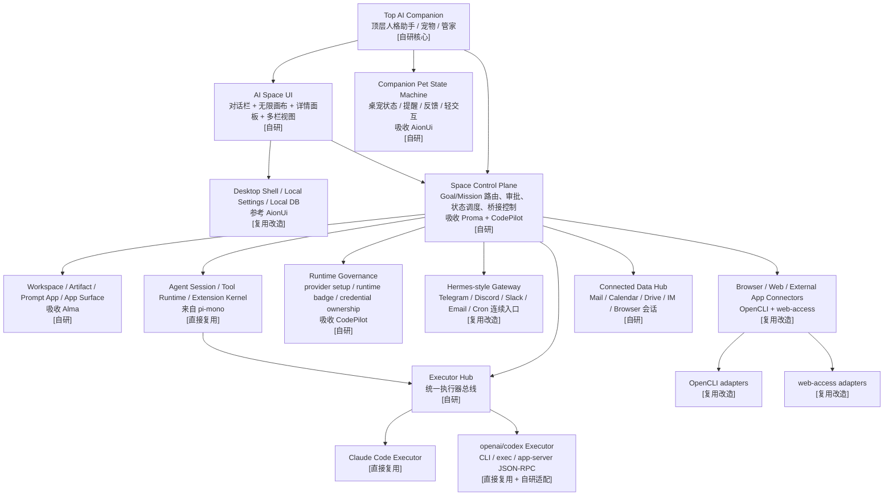
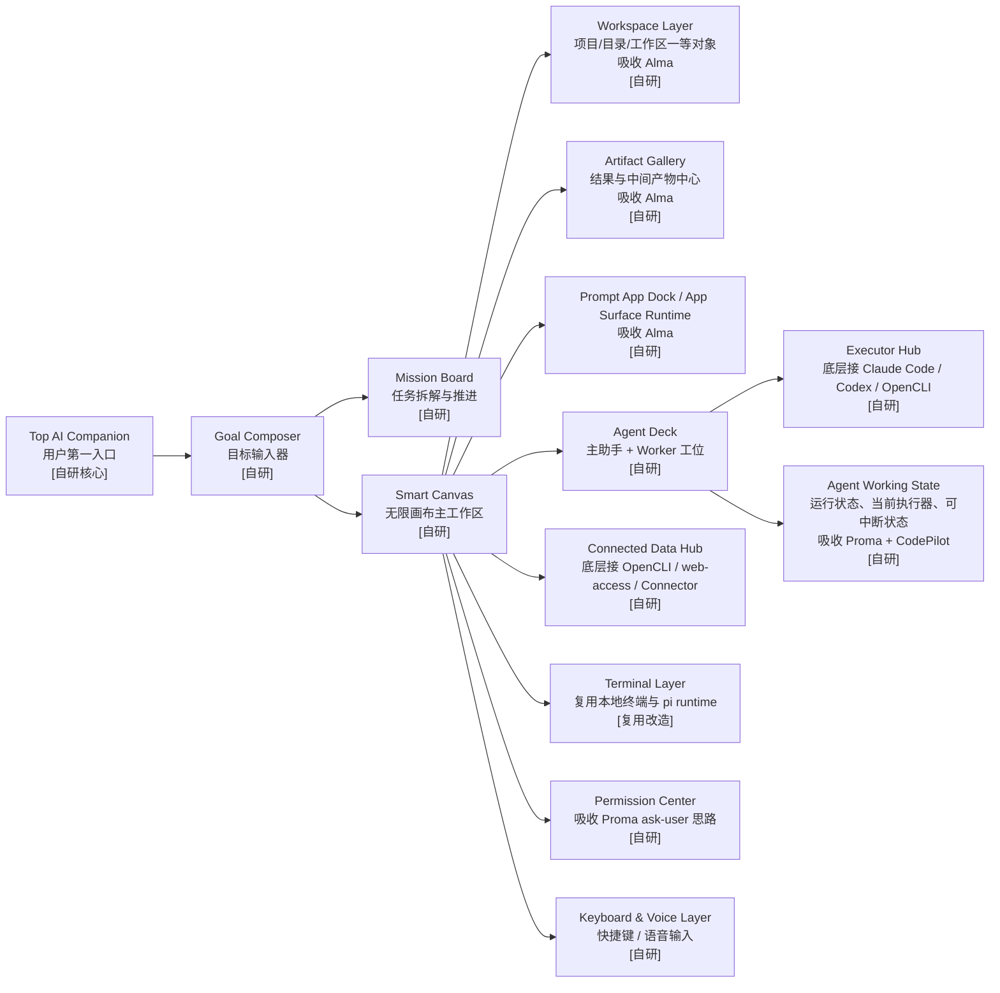

# AI Space 产品文档

## 1. 产品定位

`AI Space` 是我们最先面向用户发布的主产品。

它不是聊天工具、不是白板工具、不是 IDE，也不是传统自动化平台。  
它的定位是：

**一个本地优先、AI Native、多智能体协作的个人/团队空间，让用户和 AI 在同一个无限画布里共同处理日常与工作中的事情。**

一句话定义：

**我的 AI 空间。**

长期看，`AI Space` 不只是“使用工具的地方”，还必须是平台的默认运行面。  
也就是说：

- 用户安装的 App 可以直接在这里运行
- 小场景可以直接在这里展示
- App 的输入、结果、Artifact 和任务都会自然回到当前 Space 中

---

## 2. 为什么先做它

我们最终想做的是 `AI OS`，但直接推出终极产品会有两个问题：

- 用户太难理解
- 产品边界太大，难以形成第一阶段心智

`AI Space` 的价值在于，它能最先建立一个极强的用户认知：

**AI 产品可以不是聊天框，而是一个空间。**

而且它非常适合在前期本地优先条件下，把我们真正有差异化的能力做强：

- 本地文件
- 本地终端
- 本地 CLI
- 浏览器 relay
- 真实长任务与自动化
- 多 Agent 同时协作
- App / 小场景的直接运行与展示

---

## 3. 当前阶段交付策略

### 3.1 当前主形态

前期 `AI Space` 的正确交付方式是：

**桌面主端 + 本地运行 + 多端延展**

### 3.2 为什么前期不直接做纯云

因为前期最要验证的是：

- 空间范式是否成立
- 多 Agent 是否成立
- 日常与代码双场景是否成立
- 本地能力是否形成核心差异化
- App / 小场景形态是否成立

### 3.3 多端原则

- 桌面端完整
- 辅端可继续

辅端主要负责：

- 查看空间
- 看任务状态
- 审批
- 看结果
- 轻量对话
- 简单触发

---

## 4. 目标用户

### 4.1 普通用户

- 想要一个更聪明的数字空间
- 想让 AI 帮忙处理日常信息和轻量事务
- 不想学复杂配置

### 4.2 内容与知识工作者

- 收集资料
- 整理信息
- 创作与分发内容
- 做复盘与持续跟踪

### 4.3 程序员与高级用户

- 代码与任务并行推进
- 多 Agent 协作
- 可用本地文件、CLI、仓库、终端和浏览器能力

### 4.4 小团队

- 共享工作空间
- 看见任务状态
- 共享 AI 能力
- 共同推进长期任务

---

## 5. 产品核心承诺

`AI Space` 对用户的承诺不是“我会回答你的问题”，而是：

- 你首先会拥有一个持续存在的顶层 AI 伙伴
- 我会承接你的目标
- 我会把它变成一个可工作的空间
- 我会把多个 AI 组织起来共同推进事情
- 我会帮你持续运行和跟进
- 我会把重要信息保持可见
- 我会让你随时可以介入、调整和继续

这个承诺成立的前提是：

**`AI Space` 表层是空间，底层是统一能力环境。**

用户首先感知到的应是同一个顶层 AI 助手。  
它再去调用画布、Agent、能力和执行器。  

用户看到的是对话、画布、Agent 和结果，  
但这些元素背后调用的应该是同一套能力层，而不是彼此割裂的功能模块。

### 5.1 顶层 Companion 的正式职责

`AI Space` 的第一入口必须是一个持续存在的顶层 AI 伙伴。  
它既不是普通聊天头像，也不是单纯的系统提示词，而应有明确职责边界。

它负责：

- 统一对外人格
- 承接用户目标
- 解释系统当前状态
- 管理长期记忆的外显入口
- 主动提醒、heartbeat、轻量巡逻和跟进
- 协调内部 Worker、Executor、Connector
- 从使用经验中沉淀记忆、技能和偏好，并在合适时机提醒用户固化为能力

它不应该直接等同于：

- 所有 Worker Agent 的总和
- 底层执行器本身
- Control Plane 的全部实现
- 某一家的模型或 SDK

更准确地说：

- `Companion` 是对外主体
- `Control Plane` 是系统内核
- `Worker / Executor / Connector` 是它调动的内部劳动力

这层设计的目标是：

- 对人类保持连续关系感
- 对 AI 保持统一任务入口
- 对系统保持清晰职责分层

同时可以吸收 `AionUi` 的桌宠化方向：

- idle / thinking / working / done / error / sleeping 等状态可视化
- 轻量反馈、提醒、确认、拖拽、唤醒等微交互
- 让 Companion 不只是聊天气泡，而是有“存在感”的系统主体

还应吸收 `Hermes Agent` 的学习闭环方向：

- 记忆不是单一文本文件，而是 provider 化的长期记忆系统
- 复杂任务后可提示用户保存经验或生成技能
- 通过 session search / summarized recall 找回跨会话上下文
- 在 CLI、Gateway、Cron、ACP 等不同入口中保持同一个 Companion 连续性

---

## 6. 核心形态

### 6.1 主界面不是纯聊天，也不是纯白板

`AI Space` 的正确主形态是：

**对话栏 + 无限画布**

### 6.2 对话栏的作用

它负责：

- 发起目标
- 追问
- 补充上下文
- 和当前空间中的主助手交流
- 为当前节点追加要求

### 6.3 画布的作用

画布是主工作区。  
在这个空间里，用户可以同时看到：

- 当前目标
- 任务链
- 多个 Agent 工位
- 文档与网页
- 文件与代码
- 自动化节点
- 结果产物
- 审批点

### 6.4 聊天是节点，也是侧边交流层

聊天仍然存在，而且有两种表现：

- 作为左侧对话栏中的连续交流
- 作为画布中的某类节点或任务对话入口

### 6.5 画布是按项目 / 目录组织的

- 一个用户拥有多个 Space
- 每个 Space 对应一个项目、一个目录或一个主题
- 每个 Space 里还可以有多张画布页

### 6.6 多视图，但一个底层空间

- 聚焦视图
- 2 栏视图
- 3 栏视图
- 4 栏视图
- 移动视图

### 6.7 节点不是平面的，必须能展开

- 单击：选中并在右侧显示简要信息
- 双击：打开详情抽屉 / 弹窗 / 放大视图

### 6.8 Space 中要能直接运行“小场景 / 小 App”

`AI Space` 不能只展示任务和结果，还要能承载 App 的实际运行界面。

一个已经安装好的能力，不应该只表现为：

- 一个命令
- 一个按钮
- 一段聊天提示

它应该能直接在 Space 中表现为：

- 一个可视化面板
- 一个节点详情页
- 一个卡片式小场景
- 一个固定在画布上的网页运行面

例如：

- 邮件日报助手
- 小红书运营看板
- PR 巡检器
- 日历与行程整理助手

---

## 7. 多智能体协作是产品底色

`AI Space` 不应该是“一个用户 + 一个 AI”，  
也不应该让用户一上来就面对很多内部 Agent。  
更合理的方式是：

**一个用户 + 一个顶层 AI 伙伴 + 多个内部 AI 工作单元 + 一个共同空间**

### 7.1 v1 里的多 Agent 目标

v1 不需要做复杂 swarm，但必须证明：

- 一个顶层主助手可以存在
- 一个研究 / 内容 / 审核类 Worker Agent 可以存在
- 一个执行或验证类 Agent 可以存在

### 7.2 用户感知

用户应感受到：

- 顶层只有一个连续的 AI 主体
- AI 不是单线程人格
- 不同 AI 有不同职责
- AI 可以驱动 AI
- 结果在空间中交接，而不是都埋在聊天记录里

### 7.3 顶层主助手与内部 Worker 的关系

为了同时满足 `Human-friendly` 和 `AI-friendly`，  
前台和后台的多 Agent 关系应设计为：

- 前台默认只暴露一个顶层主助手
- 后台可以有多个 Worker Agent
- Worker 可以进一步调用多个 Executor
- 用户在需要的时候能看见 Worker 的职责和交接，但不被迫一开始就理解全部内部结构

也就是说：

- 对外是一只“宠物 / 伙伴 / 管家”
- 对内是一套“团队 / 工位 / 执行器”

---

## 8. 首页与第一次打开体验

`AI Space` 的第一次打开，不能像白板一样空白，也不能像聊天工具一样只给一个输入框。

第一屏建议元素：

- 中央：目标输入入口
- 一圈或一组：示例空间模板
- 侧边轻量区域：今日推荐能力或最近空间
- 底部轻提示：可以拖文件、粘链接、直接说一句目标

---

## 9. 核心对象

`AI Space` 里，用户能感知到的核心对象应该是：

### 9.1 Goal

一句目标、一段意图、一件想做的事。

### 9.2 Mission

一个正式任务，系统会持续推进。

### 9.3 Agent

一个工作单元，不只是头像。

### 9.4 Source

输入素材。  
例如：

- 文件
- 网页
- 图片
- 代码仓库
- 链接

### 9.5 Workspace

`Space` 背后的真实工作区对象。

### 9.6 Artifact

结果和中间产物。  
`Artifact` 应该是可以被预览、继续编辑、复制引用、下载分享的对象，而不是普通附件。

### 9.7 Automation

一个持续运行的节点。  
例如：

- 每天执行
- 检测触发
- 审批后继续

### 9.8 App / Capability

从官方或未来市场安装进来的能力卡。

其中长期最重要的是 `App`。  
它是一个可安装、可运行、可展示的成品场景，而不只是一个底层能力按钮。

App 在 `AI Space` 中至少要支持两种表现：

- 作为画布中的节点 / 卡片
- 作为双击后展开的完整场景面板

### 9.9 Prompt App

高频场景的轻应用入口。  
它位于“直接聊天”和“完整能力”之间。

### 9.10 Terminal

服务高级用户和程序员的本地执行节点。

### 9.11 Note

轻量便签 / 说明节点。

### 9.12 Unified Inbox / Connected Data

随着平台化增强，`AI Space` 还应逐步支持统一接入日常生活和工作软件的数据。  
例如：

- Mail / Gmail
- Google Calendar / Drive
- 常用 IM
- 浏览器中的真实页面与会话

这些接入后的数据不应该只是“外部列表”，而应该：

- 被统一整理成可见对象
- 能进入当前 Space 的任务流
- 能成为某个 App 的输入

---

## 10. 核心体验流程

### 10.1 从目标开始

用户输入一句话后，系统不应该只回复，而应该：

- 创建 Goal
- 绑定或创建对应 Workspace
- 生成初始 Mission 节点
- 推荐或创建对应 Agent
- 创建结果区和 Artifact 区
- 推荐可用的 App / Prompt App / Capability

### 10.2 从素材开始

用户也可以直接：

- 拖文件
- 粘网页
- 丢图片
- 导入代码仓库

### 10.3 从能力开始

用户也可以从能力卡开始。  
安装后不是只是“已启用”，而是直接在画布上生成可以工作的单元。

更进一步地说：

- 安装一个 App 后，应直接生成它的默认 Surface
- 用户能立刻看到这个场景要什么输入、会产生什么结果

---

## 11. 前期架构与功能模块

### 11.1 图例

为避免文档只讲概念，下面两张图统一使用 3 个标签：

- `[直接复用]`：现成项目可直接接入
- `[复用改造]`：已有项目可作为底子，但需要改成我们的对象和流程
- `[自研]`：必须自己写，不能被现成项目绑死

### 11.2 AI Space 前期架构图



### 11.3 AI Space 前期功能模块图



### 11.4 复用边界

`AI Space` 前期最务实的组合应该是：

- `Alma`：吸收 `workspace / artifact / prompt app`，但不照搬它的超胖主进程 `[复用改造]`
- `Proma`：吸收控制层、权限中断、bridge、working sidebar、流式中断和 tab persistence 思路 `[复用改造]`
- `CodePilot`：吸收 runtime abstraction、provider setup intercept、provider governance、permission broker、runtime badge 思路 `[复用改造]`
- `pi-mono`：复用 session、extension、tool runtime `[直接复用]`
- `Claude Code`、`openai/codex`：作为最强代码执行器；`Codex app-server` 的 Thread / Turn / Item / sandbox / approval / review / command exec 协议应作为 `Code Executor Adapter` 的重点参考 `[直接复用 + 自研适配]`
- `OpenCLI`、`web-access`：作为网页和外部软件连接器，同时吸收自修复、站点经验、CDP proxy、并行子 Agent 浏览策略 `[复用改造]`
- `AionUi`：吸收桌面壳、ACP 模块化协议、桌宠状态机、内置技能管理、team/remote agent、cron/channel/plugin 经验，但不拿它当最终产品壳 `[复用改造]`
- `Hermes Agent`：吸收跨平台 gateway、cron scheduler、terminal backend、memory provider、skills self-improvement、tool gateway 和 trajectory capture 思路 `[复用改造]`

同时还要明确 3 个体验标准：

- `AI-friendly`：对象、状态、权限、结果对 AI 易理解
- `Iterative-friendly / 渐进友好`：允许边做边修、插话、局部重跑、审批后继续
- `Human-friendly`：默认只面对一个顶层 AI 伙伴，复杂性藏在后面

### 11.4.1 AI Space v1 推荐代码模块落点

从代码仓库边界看，`AI Space v1` 最合理的落点应是：

```text
apps/
  space-desktop/                 # Space 桌面主端壳

packages/
  companion/
    companion-core/              # 顶层 Companion 人格与主入口逻辑
    companion-memory-view/       # 记忆的外显与压缩视图
    companion-presence/          # 提醒、heartbeat、轻巡逻

  control/
    control-plane/               # Goal/Mission 总控
    task-routing/                # 任务与执行器路由
    approval-engine/             # 审批与权限中断

  workspace/
    workspace-core/              # Workspace 一等对象
    artifact-core/               # Artifact 一等对象
    thread-core/                 # Thread / Message / Run 关联

  capability/
    app-surface-runtime/         # Space 内 App / Prompt App / Surface 运行

  ui/
    ui-design-system/
    ui-canvas/
    ui-panels/
    ui-node-renderers/

  runtime/
    runtime-core/                # 主要吸收自 pi-mono
    runtime-session/
    runtime-extension/

  executors/
    executor-protocol/
    executor-claude-code/
    executor-codex/
    executor-opencli/
    executor-browser/

  connectors/
    connector-protocol/
    connector-browser-session/
    connector-git/
    connector-mail/
    connector-calendar/
```

模块边界原则：

- `space-desktop/` 是薄壳，不承载核心业务
- Companion 必须独立成包，不能散在 UI 里
- Canvas/UI 层不直接知道上游 SDK，只通过 `control-plane` 和 `executor-protocol` 间接使用能力
- `workspace-core`、`artifact-core`、`thread-core` 是 Space 的产品主梁，不能混进 adapter 代码
- 代码执行器与浏览器执行器全部走 `executors/*`，不进入 UI 和产品对象层

### 11.5 主要功能模块

### 11.5.1 Goal Composer

产品级的目标输入器。

### 11.5.2 Smart Canvas

无限画布核心。

### 11.5.3 Workspace Layer

负责把画布和真实目录连接起来。

### 11.5.4 Agent Deck

Agent 工位区。

Agent Deck 不只是头像列表，还应显示：

- 当前 Agent 在做什么
- 使用哪个执行器
- 是否可中断
- 是否等待审批
- 是否在后台继续

这点应吸收 `Proma` 的 Working section 与 `CodePilot` 的 runtime badge / setup intercept 经验。

### 11.5.5 Mission Board

使命与任务系统。

### 11.5.6 Prompt App Dock

高频入口层。

### 11.5.6.1 App Surface Runtime

这层是 `AI Space` 平台化以后最关键的新模块之一。  
它负责：

- 在 Space 中渲染 App 的网页界面
- 支持卡片、看板、表格、表单、时间线、仪表盘等形态
- 让一个场景既能作为节点存在，也能展开为完整页面

### 11.5.7 Artifact Gallery

结果区和产物区。

某些稳定的 Artifact 结果，未来还应支持：

- 固化成一个可反复打开的 App 页面
- 作为某个小场景的结果面

### 11.5.8 Automation Layer

自动化不是隐藏设置，而是空间里的活节点。

### 11.5.9 Terminal Layer

服务高级用户和程序员。

### 11.5.10 Global Command

顶层命令入口。

### 11.5.11 Keyboard & Voice Layer

必须从第一天起支持：

- 画布快捷键
- 节点快捷键
- AI 快捷键
- 语音输入

---

## 12. 典型场景

### 场景 A：日常信息整理

### 场景 B：多平台内容分发

### 场景 C：代码任务推进

### 场景 D：长期自动化

### 场景 E：项目化空间管理

### 场景 F：一人公司运行

### 场景 G：安装一个 App 后直接工作

用户在 Store 中安装一个“邮件日报助手”，进入当前 Space 后立刻看到：

- 授权与输入区
- 今日邮件摘要面板
- 生成结果 Artifact
- 可继续编辑和发送的动作区

---

## 13. 视觉与交互气质

`AI Space` 不应该有传统企业后台感，也不应该像实验性白板。

它的气质应该是：

- 有空间感
- 有生命感
- 有秩序
- 不冷
- 不吵
- 不模板化

---

## 14. 版本边界

### 14.0 V0.1 最小闭环

在进入完整 V1 之前，`AI Space` 应先证明一个最小但完整的空间闭环。

这个闭环是：

```text
创建 Space
-> 输入 Goal
-> Companion 创建 Mission
-> 调用一个 Executor
-> 产生 Run 事件
-> 生成 Artifact
-> Artifact 回到 Canvas
-> 用户继续追问、审批、调整或保存
```

这个闭环的重点不是功能数量，而是证明：

- 用户不是只在聊天，而是在 Space 中推进一件事
- Companion 是统一入口，而不是 UI 装饰
- Mission、Run、Artifact 能形成可见链路
- Executor 可以替换，但结果必须回到同一个 Space
- 用户可以中途介入，而不是只能等一次性结果

如果这个闭环不成立，继续增加连接器、App Surface 或多 Agent 数量都容易变成功能堆砌。

### 14.0.1 V0.1 工程范围约束

`V0.1` 是第一轮工程验收目标，`V1` 是产品化扩展目标。  
第一轮开发必须按长期正确架构设计，但交付功能只服务最小主闭环。

#### V0.1 产品能力

V0.1 必须同时覆盖两类入口：

- 普通 chatbot 对话
- Space 中的代码任务执行

普通对话用于证明：

- Companion 可以作为日常 AI 助手入口
- 用户可以配置自己的模型 Provider
- 自定义 API URL 和 API Key 能用于真实模型调用
- 对话结果可以保存为 Note 或 Artifact

代码任务用于证明：

- Space 可以承接 Mission
- Codex 和 Claude Code 都能作为一等 Code Executor 接入
- 两个执行器都通过统一 `Code Executor Protocol` 回流 Run、Event、Approval 和 Artifact
- 用户看到的是一致的任务过程，而不是两个执行器各自的 UI

#### V0.1 固定调用链

Companion 不直接调用执行器。

V0.1 固定链路为：

```text
Companion
-> Control Plane
-> Code Executor Protocol
-> executor-codex / executor-claude-code
```

Canvas / UI 只消费 Control Plane 和 Kernel Events，  
不能直接依赖 Codex 或 Claude Code 的原生事件格式。

#### V0.1 必落对象

V0.1 需要真实落地这些对象：

- `Space`
- `Workspace`
- `Thread`
- `Mission`
- `Run`
- `Artifact`
- `Event` 的最小子集
- `Approval` 的最小记录
- `ProviderConfig`

下面这些对象在 V0.1 只做轻量占位或接口预留：

- `App`
- `Connector`
- `Memory`
- `Automation`
- `Capability`

#### V0.1 最小事件链

V0.1 不需要完整 Event Bus，但需要统一最小事件链：

```text
mission.created
run.started
run.stream
approval.requested
approval.granted
approval.rejected
artifact.created
run.completed
run.failed
run.interrupted
executor.status_changed
```

#### V0.1 实际开包建议

第一轮工程可以先开这些包，避免一开始生成大量空壳：

```text
apps/
  space-desktop/

packages/
  kernel/
    kernel-objects/
    kernel-events/

  companion/
    companion-core/

  conversation/
    conversation-core/

  model-providers/
    provider-protocol/
    provider-openai-compatible/
    provider-anthropic-compatible/

  control/
    control-plane/

  workspace/
    workspace-core/
    artifact-core/

  executors/
    executor-protocol/
    executor-codex/
    executor-claude-code/

  trust/
    approval-core/
```

如果需要进一步收敛，`kernel-events` 可以先并入 `kernel-objects`，`artifact-core` 可以先并入 `workspace-core`。  
但 `executor-codex` 和 `executor-claude-code` 不应二选一，它们是验证执行器可替换性的最低要求。

### 14.1 V1 必须做的

- 左侧可用的对话栏
- 无限画布主界面
- Goal / Mission / Agent / Source / Artifact / Terminal / Note 节点
- 节点双击查看详情
- 按项目 / 目录组织空间
- 画布 / 系统 / AI 快捷键
- 基础语音输入
- 多端继续
- 官方精选能力安装
- 至少一类可运行 App Surface
- App 结果能回到当前 Space
- 至少一类生活 / 工作连接器的可见接入面

### 14.2 V1 不该做的

- 公开能力市场
- 复杂团队权限体系
- 大规模 swarm 编排
- 太多底层配置暴露

---

## 15. 成功标准

如果 `AI Space` 成功，用户会形成这些认知：

- 这不是聊天工具
- 我可以在这里处理很多不同的事
- 不只是一个 AI，而是一组 AI 在替我协同做事
- 我既可以像聊天一样使用它，也可以像操作工作台一样使用它
- 我的信息和结果不会消失在聊天记录里

---

## 16. 在最终 AI OS 中的角色

`AI Space` 最终会成为 AI OS 的：

- 默认首页
- 默认空间
- 默认任务承接层
- 默认日常使用入口
- 默认多智能体协作界面

它是终极产品的“使用面”。
