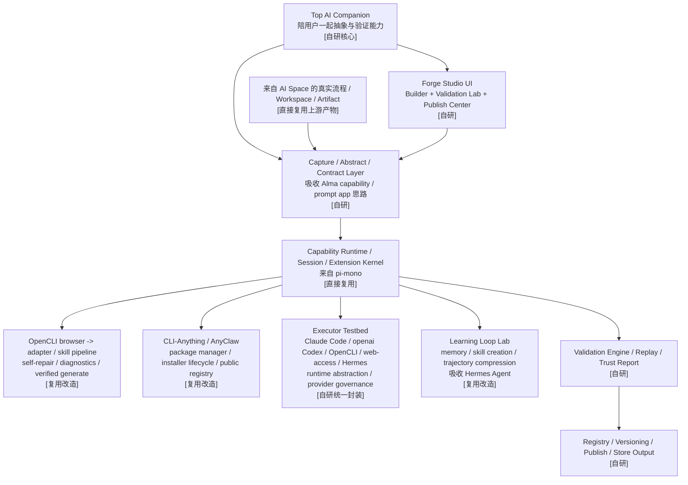
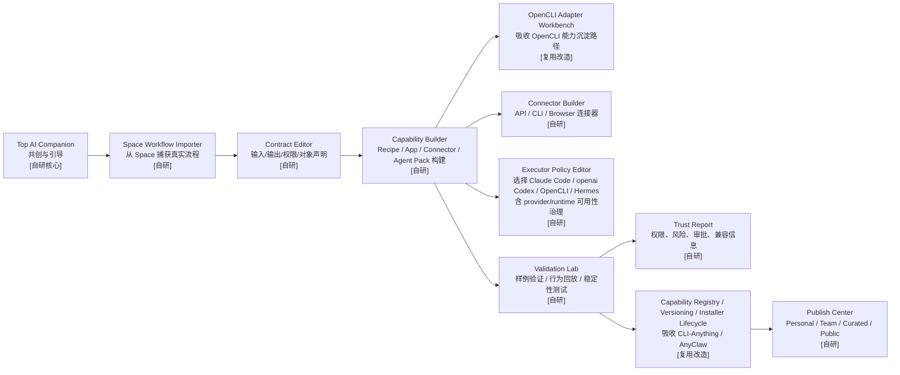

# AI Forge 产品文档

## 1. 产品定位

`AI Forge` 是我们在 `AI Space` 之后推出的第二个核心产品。

它不是普通用户每天都会打开的产品，  
而是一个给高级用户、开发者、团队和生态作者使用的：

**本地优先的 AI 能力构建、验证与发布工作坊。**

一句话定义：

**把“我在空间里跑通的一件事”，变成“可以反复使用、可以共享、可以发布的能力”。**

进一步说，`AI Forge` 最终还要负责把能力包装成：

- 可安装的 App
- 可接入的 Connector
- 可进入 Store 的正式平台资产

---

## 2. 为什么它必须独立出来

如果把能力构建、验证、发布全部塞进主产品首页，会带来两个问题：

- 普通用户会被复杂性吓到
- 能力生态永远做不起来，因为创作体验会非常弱

因此 `AI Forge` 必须作为独立产品存在一段时间，专门服务“从使用走向创造”的用户。

---

## 3. 当前阶段交付策略

本文件定义的是 `AI Forge` 的产品边界和后续阶段形态。  
第一轮工程不应直接开 Forge 产品壳，而应先在 `AI Space V0.1` 中预留能力契约、验证和注册表边界。

### 3.1 当前主形态

前期 `AI Forge` 同样采用：

**本地优先 + 桌面主端**

### 3.2 为什么前期不直接做纯云 Forge

因为前期能力最真实的来源，正是用户在本地空间中已经跑通的事情。

### 3.3 未来演进

未来 `AI Forge` 会演进为：

- 本地构建 + 本地验证
- 云端审核 + 云端发布
- 团队能力中心
- 公共市场入口

---

## 4. 目标用户

### 4.1 高级用户

- 把自己的空间工作流保存下来
- 下次直接复用
- 给自己做专属 AI 能力

### 4.2 程序员与自动化作者

- 定义更复杂的输入输出
- 连接 API / CLI / 浏览器 / 文件系统
- 做出可靠可复用的能力单元

### 4.3 团队管理员和组织内部作者

- 给团队做内部专用能力
- 做标准化工作流
- 控制权限、说明、质量和发布范围

### 4.4 生态创作者

- 在平台上发布能力
- 形成个人品牌或团队品牌
- 让别人安装和使用

---

## 5. 产品核心承诺

`AI Forge` 的核心承诺不是“教你配置”，而是：

- 帮你把已经跑通的事情抽象成能力
- 帮你验证它是否可靠
- 帮你包装得对别人可理解、可安装、可信任
- 帮你在私有、团队或公共环境中分发

而且这个过程，不应该只是用户独自面对一堆表单。  
更合理的方式是：

- 顶层 AI 助手陪用户一起抽象能力
- 帮用户补输入输出、权限、执行器建议
- 帮用户生成验证样例和发布说明

从更底层看，`AI Forge` 的使命是：

**把 `AI Space` 中的即时操作，转化成 Agent 能长期使用的能力环境资产。**

---

## 6. 它和 AI Space 的关系

### 6.1 AI Space 负责“用”

用户在 `AI Space` 中：

- 发起目标
- 完成任务
- 形成空间与结果

### 6.2 AI Forge 负责“造”

用户在 `AI Forge` 中：

- 抽象能力
- 编辑能力
- 测试能力
- 验证能力
- 发布能力

### 6.3 二者最终统一

未来统一成 `AI OS` 后，二者不是两个割裂产品，而是两个模式：

- `Use`
- `Create`

---

## 7. Forge 的核心对象

`AI Forge` 里，用户主要接触的不是聊天和任务，而是能力对象。

### 7.1 App

面向普通用户的成品能力。  
例如：

- 多平台分发助手
- PR Review 助手
- 每日摘要助手

一个 App 不应该只是能力封装，而应是：

- 有场景页面
- 有明确输入输出
- 有依赖连接器
- 有权限与风险说明
- 能在 `AI Space` 中直接运行和展示

### 7.2 Prompt App / Mini App

高频场景的轻应用能力。

### 7.3 Recipe

明确的工作流程能力。

### 7.4 Skill Pack

更偏知识与规则层的能力包。

### 7.5 Connector Pack

连接外部世界的能力包。  
例如：

- 某平台 API 连接
- 某 CLI 能力封装
- 某浏览器桥接能力
- 某外部 coding executor 接入

Connector Pack 长期还应支持接入分级：

1. 官方 API / SDK
2. CLI
3. Browser / Extension / Automation
4. 自研适配器
5. 未来开放接口后切换

### 7.6 Automation Template

可直接部署的自动化能力模板。

### 7.7 Agent Pack

角色化能力包。

### 7.8 Multi-Agent Capability

能力不仅可以是单 Agent，也可以是：

- planner + executor + verifier
- 内容生成 + 发布 + 监控
- 仓库分析 + 修复 + 评审

### 7.9 Organization Template

可运行的组织模板。

### 7.10 Capability as Environment Unit

Forge 构建的不是“工具配置”，而是“Agent 能长期工作的环境单元”。

### 7.11 App Contract

这是 `AI Forge` 长期最重要的对象之一。  
每个 App 或高级能力都必须有标准契约，至少说明：

- 处理哪些对象
- 依赖哪些 Connector
- 需要哪些权限
- 输入是什么
- 输出是什么
- 有哪些 UI Surface
- 是否支持后台运行
- 是否支持自动化触发
- 是否支持多 Agent 协作

---

## 8. 核心流程

`AI Forge` 的产品体验应该围绕一个非常清楚的路径：

# Capture -> Abstract -> Contract -> Configure -> Validate -> Share -> Publish

### 8.1 Capture

从 `AI Space` 中捕获一段成熟工作区。

### 8.2 Abstract

系统帮助用户识别：

- 这个能力解决什么问题
- 它的输入是什么
- 它的输出是什么
- 哪些步骤是固定的
- 哪些步骤是用户可配置的
- 是否涉及多个 Agent 分工
- 是否适合继续保留顶层 Companion 统一对外
- 哪些内部步骤应该下放给 Worker 或专用 Executor

### 8.3 Contract

在正式编辑之前，系统还要帮助用户把一个能力抽象成标准契约。  
也就是说，把“这件事能跑”进一步收紧为：

- 处理什么对象
- 需要哪些连接器
- 需要哪些权限
- 结果如何展示
- 哪些步骤可自动化
- 哪些步骤必须审批

### 8.4 Configure

用户再进一步调整：

- 名称
- 描述
- 分类
- 入口形式
- 输入参数
- 输出说明
- 所需权限
- 推荐场景
- 风险提示
- 参与 Agent 角色
- 任务所有权规则
- heartbeat 规则
- 审批与预算边界
- 执行器策略

### 8.4.1 Capability Contract 的最小正式字段

为了让能力真正可验证、可安装、可发布，  
`AI Forge` 中的每个正式能力至少应补齐这些字段：

- `name`
- `goal`
- `input`
- `output`
- `objectScope`
- `requiredConnectors`
- `requiredPermissions`
- `surface`
- `backgroundMode`
- `approvalPolicy`
- `executorPolicy`
- `artifactsProduced`
- `validationCases`
- `trustLevel`

其中要特别强调：

- `objectScope`：说明能力处理哪些统一对象
- `surface`：说明能力如何在 `AI Space` 中呈现
- `executorPolicy`：说明优先调用哪个执行器
- `validationCases`：说明至少用什么样例验证过

这不是为了增加配置复杂度，而是为了让能力真正成为平台资产。

### 8.4.2 Code 能力的执行器原则

所有 `Code` 类能力，前期都应优先直接利用：

- `Claude Code`
- `openai/codex`

可以参考 Claude Agent SDK 一类接入方式，  
但平台内部不能直接依赖某一家 SDK 作为系统内核。  
更合理的长期方式是：

- `Claude Code` 和 `openai/codex` 都是一等 Code Executor
- 对外允许接入不同 coding executor
- 对内只认统一的 `Code Executor Protocol`
- 对 `openai/codex`，优先研究 `codex app-server` 的 JSON-RPC 方式，而不是只把它当 CLI 子进程
- 对 `Claude Code`，优先保证真实 coding 体验和本地执行可靠性

这样既保留最强 coding 能力，也保留系统主权。

`Codex app-server` 对 Forge 尤其有价值，因为它已经提供：

- `Thread / Turn / Item` 三层交互对象
- `turn/start`、`turn/interrupt`、`turn/steer`
- `thread/fork`、`thread/rollback`、`thread/compact/start`
- `review/start`
- `command/exec`
- `fs/watch`
- app / plugin / skill / MCP / marketplace API
- sandbox policy 和 approval policy 覆盖

这些都应成为我们 `Code Executor Protocol` 和 `Validation Lab` 的重点参考。

同时需要吸收 `CodePilot` 的 runtime abstraction 思路：

- runtime 可以多实现并存
- provider transport 与 runtime 选择要分离
- setup / credential / provider presence 要在能力验证前先被拦截
- 用户看到的是能力是否可用，而不是底层 SDK 细节

### 8.5 Validate

这是 `AI Forge` 和普通“技能编辑器”的本质区别。

用户应该看到：

- 跑通了没有
- 成功率如何
- 平均耗时
- 对 Workspace / Artifact 的影响是什么
- 哪些步骤不稳定
- 哪些地方需要审批
- 哪些 Agent 容易失效
- 任务归属是否清楚
- heartbeat 和预算是否合理
- 风险等级是什么

长期看，验证系统还必须支持：

- 行为回放
- 输入样例测试
- UI Surface 渲染测试
- Connector 可用性测试
- 自动化成功率测试

### 8.6 Share

- 只给自己
- 只给团队
- 给指定人群试用

### 8.7 Publish

最终用户可以把能力发布到：

- 私有库
- 团队库
- 精选中心
- 公共市场

而且 Store 中发布的不应只有一种对象。  
长期应支持：

- App
- Connector
- Skill / Recipe
- Agent Pack

---

## 9. 核心界面形态

`AI Forge` 不应该长成一个传统插件管理后台。  
它应该像一个：

**能力工作坊 + 验证实验室 + 能力发行中心**

---

## 10. 前期架构与功能模块

### 10.1 图例

为保证一眼能看懂，下面两张图统一使用：

- `[直接复用]`
- `[复用改造]`
- `[自研]`

### 10.2 AI Forge 前期架构图



### 10.3 AI Forge 前期功能模块图



### 10.4 复用边界

`AI Forge` 前期最该吸收的是：

- `pi-mono`：复用 session、extension runtime、tool registry，同时吸收 extension hook ABI、prompt/resource loader、RPC/SDK embedding、provider policy `[直接复用 + 复用改造]`
- `OpenCLI`：吸收 `browser/operate -> 稳定命令 -> 自修复 -> 验证生成 -> 能力沉淀` 生产路径 `[复用改造]`
- `CLI-Anything / AnyClaw`：吸收 repo、install、search、registry、installer/updater/uninstaller lifecycle、public source federation 思路 `[复用改造]`
- `Alma`：吸收 capability system、prompt app、中间能力层设计 `[复用改造]`
- `CodePilot`：吸收 runtime abstraction、provider governance、permission broker、subagent 权限继承、runtime badge 和 setup intercept 思路 `[复用改造]`
- `Claude Code`、`openai/codex`：作为 Forge 验证时的重要代码执行器；`Codex app-server` 可作为协议型 code executor 后端重点参考 `[直接复用 + 自研适配]`
- `web-access`：作为网页能力验证和连接器测试来源，吸收 agent-agnostic skill、CDP proxy、站点经验积累和并行分治策略 `[复用改造]`
- `AionUi`：吸收 ACP 2.0 模块化协议、内置技能管理、team/remote agent、cron 更新流程、channel/plugin 体系和桌宠反馈机制 `[复用改造]`
- `Hermes Agent`：吸收 closed learning loop、skills self-improvement、memory provider、gateway delivery、cron scheduler、terminal backend、tool gateway、trajectory capture / compression `[复用改造]`

同时要满足 3 个标准：

- `AI-friendly`：能力契约、执行记录、验证结果对 AI 易理解
- `Iterative-friendly / 渐进友好`：支持逐步抽象、局部验证、边做边修、失败后回退
- `Human-friendly`：作者不是在填底层配置，而是在顶层 AI 助手陪同下完成能力打包

### 10.4.1 AI Forge v1 推荐代码模块落点

从仓库模块边界看，`AI Forge v1` 最合理的落点应是：

```text
apps/
  forge-desktop/                 # Forge 桌面主端壳

packages/
  capability/
    capability-contract/         # 正式能力契约
    capability-builder/          # Recipe / App / Connector 构建
    validation-core/             # 样例验证、稳定性、回放
    registry-core/               # Registry / Versioning / Install
    installer-core/              # install / update / uninstall 生命周期
    capability-resolver/         # 从 registry/source 解析可用能力
    public-source-ingestor/      # 公共源导入和兼容检查
    publish-core/                # 发布与分级

  control/
    approval-engine/             # Forge 中的权限与审批

    runtime/
    runtime-core/                # 主要吸收自 pi-mono
    runtime-session/
    runtime-extension/
    runtime-acp/                 # ACP / 外部 Agent 协议适配，吸收 AionUi
    runtime-codex-app-server/    # Codex app-server JSON-RPC 适配
    runtime-hermes-gateway/      # Hermes-style gateway / terminal backend 适配

  executors/
    executor-protocol/
    executor-claude-code/
    executor-codex/
    executor-codex-app-server/
    executor-hermes/
    executor-opencli/
    executor-browser/

  connectors/
    connector-protocol/
    connector-browser-session/
    connector-git/
    connector-mail/

  sdk/
    sdk-app/                     # 给官方和社区作者
    sdk-connector/
    sdk-community/
    sdk-agent-protocol/          # 给外部 Agent / ACP / remote agent 适配

community/
  official-apps/
  official-connectors/
  official-recipes/
  templates/
```

模块边界原则：

- `forge-desktop/` 只做创作面壳，不吞掉 contract、validation、registry 逻辑
- `capability-contract/` 是整个平台的正式语言，不能散落在页面表单里
- `validation-core/` 和 `publish-core/` 必须独立，不能变成“保存按钮旁边的一段逻辑”
- `sdk/*` 要从第一天起预留，这是未来社区友好的关键
- `community/` 必须和 `packages/` 分层，避免官方内核与社区资产混杂

### 10.5 核心模块

### 10.5.1 Capability Library

能力库。

### 10.5.2 Builder

能力编辑器。

### 10.5.3 Validation Lab

验证中心。

### 10.5.4 Trust Report

信任报告。

### 10.5.5 Publish Center

发布中心。

### 10.5.6 Store & Registry

这是 `AI Forge` 平台化以后必须出现的正式模块。  
它负责：

- Store 展示
- Registry 管理
- App / Connector / Skill 的分发
- 信任等级与兼容信息
- 安装与升级记录

### 10.5.7 Analytics

能力数据看板。

---

## 11. 验证与审核体验

### 11.1 对作者来说

作者需要明确知道：

- 我的能力是不是能用
- 它稳不稳定
- 哪些步骤风险高
- 哪些 Agent 分工不合理
- 上架前还差什么

### 11.2 对用户来说

用户看到能力时，需要有放心感。  
所以每个能力都应该有：

- 验证状态
- 权限清单
- 适用场景
- 风险等级
- 最近稳定性
- Official / Verified / Community / Local 分类
- 会不会后台持续运行
- 会不会主动修改或发送外部数据

### 11.3 Replay 不是可选项

对于未来社区和平台治理来说，`Replay` 不应该是附属能力，而应是正式模块。  
它至少要支持：

- 能力执行轨迹回看
- 样例输入回放
- 关键审批点回看
- 失败点定位
- 能力版本对比

只有这样，社区贡献、团队治理、平台审核才会真正可持续。

### 11.4 自修复与诊断也不是可选项

Forge 中所有外部世界能力，尤其是浏览器和站点适配能力，都必须有自修复与诊断路径。  
这里应吸收 `OpenCLI` 的新方向：

- 失败时生成结构化诊断
- 明确可编辑 adapter 源文件
- 通过原命令重跑作为 verify oracle
- 限制修复范围，避免 AI 误改核心系统
- 修复成功后进入回归样例和能力版本记录

这会直接提升能力层的 `AI-friendly`、`Iterative-friendly / 渐进友好` 和社区可维护性。

---

## 12. 发布层级

`AI Forge` 应支持 4 种发布层级：

- Personal
- Team
- Curated
- Public

同时 Store 还应该有信任分层：

- Official
- Verified
- Community
- Local / Private

未来面向社区时，推荐形成清楚的贡献阶梯：

- Personal：自己可用
- Team：团队共享
- Curated：平台精选
- Community Verified：社区作者发布且通过验证
- Public：公共市场可安装

---

## 13. 第一版边界

### 13.1 V1 必须做的

- 从 `AI Space` 导入一段工作流
- 形成基础能力对象
- 编辑名称、说明、输入输出
- 查看基础权限与风险说明
- 做基础验证
- 私有保存
- 团队共享

### 13.2 V1 不该做的

- 一上来就完全公开市场
- 太复杂的商业化结算
- 无限类型的能力包
- 过度开放的低质量上传入口

---

## 14. 成功标准

如果 `AI Forge` 成功，用户会形成这些认知：

- 我的做法不是一次性的
- 我可以把我的 AI 工作方式沉淀下来
- 我的团队可以共享统一能力
- 这个系统真的在往生态长

---

## 15. 在最终 AI OS 中的角色

统一成 `AI OS` 后，`AI Forge` 会成为：

- 能力创建模式
- 能力验证模式
- 能力发布模式

它是整个 AI OS 的“创造面”和“生态供给面”。

---

## 16. 最终一句话

`AI Forge` 的使命不是做一个配置后台，也不是做一个插件上传页。  
它要成为：

**把真实使用沉淀为能力、把个人经验升级为平台资产、把单 Agent 做法进化成多智能体能力系统，并把这些能力包装成可安装、可验证、可分发的 App / Connector / Skill 生态的工作坊。**
